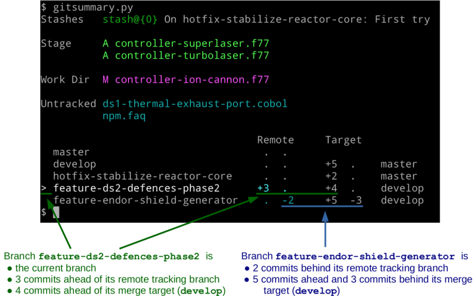
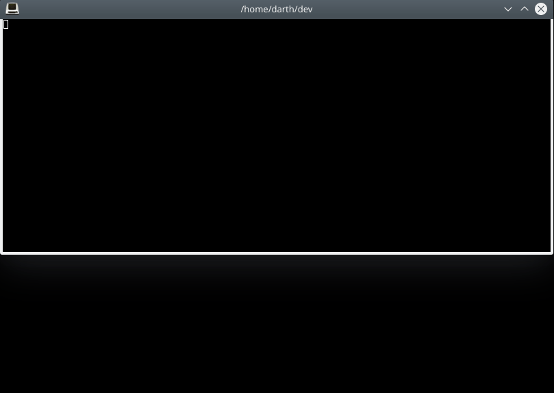

# gitsummary

A better `git status`:
- stashes
- file statuses
- branch list
    - number of commits ahead/behind remote tracking branch
    - number of commits ahead/behind merge target

All nicely formatted with color.

## Example


In addition to the usual stashes and file statuses, this output is showing the
following branch information:

- `master`
    - In sync with its remote tracking branch
    - Has no merge target
- `develop`
    - In sync with its remote tracking branch
    - 5 commits ahead of its merge target (`master`)
- `hotfix-stabilize-reactor-core`
    - In sync with its remote tracking branch
    - 2 commits ahead of its merge target (`master`)
- `feature-ds2-defences-phase2`
    - 3 commits ahead of its remote tracking branch
    - 4 commits ahead of its merge target (`develop`)
- `feature-endor-shield-generator`
    - 2 commits behind its remote tracking branch
    - 5 commits ahead and 3 commits behind its merge target (`develop`)

See it in action using the `gmon` helper script:


## What is a 'Merge Target'?
A merge target is the branch that `gitsummary` is expecting a particular branch
to be merged into.

For any given branch, the merge target is determined by the first regular
expression that matches that branch:

Regular Expression  | Merge Target
------------------- | ------------
^master$            |   [None]
^develop$           |   master
^hotfix-            |   master
^release-           |   master
[everything else]   |   develop

You can specify your own merge targets in a `.gitsummaryconfig` file
(see below).

## Shell Prompt Helper
`gitsummaryShellHelper.sh` is a simple script you can use to insert a summary of your git repo status into your shell prompt. It is fully customizeable using variables at the top of the script.

You can choose any or all of the following, in any order, styled using any ANSI styles (foreground color, background color, bright, etc):

- number of stashes
- number of staged files
- number of modified files in the work dir
- number of unmerged files
- number of untracked files
- number of commits ahead / behind of the corresponding remote tracking branch
- number of commits ahead / behind the target branch
- branch name
- target branch name

A simple way to use it for a bash prompt is to add this to your `.bashrc`:

```
function fancyPrompt()
{
    export PS1="$(gitsummaryShellHelper.sh)$ "
}
PROMPT_COMMAND=fancyPrompt
```

You can see it in action here -- the same demo as above, but now using `gitsummaryShellHelper.sh` to create the shell prompt:



## `gmon` -- A simple `gitsummary` looper
`gmon` is the simple script used in the demo above. It:

- clears the screen
- runs `gitsummary`
- sleeps 1 second
- repeats

## Usage
```
Usage:
    ./gitsummary.py [OPTIONS]
    ./gitsummary.py shell-prompt-helper [OPTIONS]

In the first form, print a summary of the current git repository's status:
    - stashes, staged changes, working directory changes, unmerged changes,
      untracked files
    - list of local branches, including the following for each:
          - number of commits ahead/behind its remote tracking branch
          - number of commits ahead/behind its target branch
          - the name of its target branch

In the second form, print a single line of space-separated values that can be
easily parsed to provide a fancy shell prompt:
    - number of:
          - stashes, staged changes, working directory changes,
            unmerged changes, untracked files,
          - commits ahead of remote branch, commits behind remote tracking
            branch,
          - commits ahead of target branch, commits behind target branch
    - current branch name, target branch name

Also in the second form, values that have no meaning will be replaced with "_":
    - number of commits ahead/behind remote if there is no remote tracking
      branch
    - number of commits ahead/behind target if there is no target branch

Options:
    --custom SECTIONS
        - Show only the specified SECTIONS of output, in the order specified
        - Valid section names for the first form above are:
              stashes, stage, workdir, unmerged, untracked,
              branch-all, branch-current
        - Valid section names for the second form above are:
              stashes, stage, workdir, unmerged, untracked,
              ahead-remote, behind-remote, ahead-target, behind-target,
              branch-name, target-branch

    --color
        - Force the use of colored output even if stdout is not a tty

    --no-color
        - Do not show colored output

    --no-optional-locks
        - Use git's --no-optional-locks option. Useful if you want to run
          gitsummary in the background or a loop

    --max-width N
        - Format output for a maximum width of N columns, regardless of
          current terminal width

    --help
        - Show this output

    --helpconfig
        - Show information for the gitsummary configuration file

    --version
        - Show current version
```

## Requirements
python3

## Installation
Easy! Just copy [gitsummary.py](gitsummary.py)
to a folder in your path, and you're set!

## Configuration File
The gitsummary configuration file (`.gitsummaryconfig`) is a json-formatted
file used to specify:

- the order in which branches are printed
- branch names and their corresponding targets

Any line beginning with `//` (with optional preceding whitespace) is treated as
a comment and thus ignored.

The following is a sample configuration file that matches the built-in defaults:
```
{
    // Specify the order in which to display branches
    //     - Branches that match the first regular expression are displayed
    //       first (in alphabetical order), followed by branches matching
    //       the second regular expression, and so on
    //     - Branches not matching any of the regular expressions are
    //       listed last (also in alphabetical order)
    "branchOrder": [
        "^master$",
        "^develop$",
        "^hotfix-",
        "^release-"
    ],

    // Specify the default target branch if none of the regular expressions
    // in "branches" (see below) match. "" is a valid value.
    "defaultTarget": "develop",

    // Specify branches and their corresponding target branches
    //     - When displaying branch information, the branch name is
    //       matched against the "name" regular expressions below, in
    //       successive order, until a match is made
    //     - The "target" of the first match will be shown as the branch's
    //       target branch
    "branches": [
        {
            "name"  : "^master$",
            "target": ""
        },
        {
            "name"  :"^develop$",
            "target": "master"
        },
        {
            "name"  :"^hotfix-.*",
            "target": "master"
        },
        {
            "name"  :"^release-.*",
            "target": "master"
        }
    ]
}
```
Gitsummary will look for `.gitsummaryconfig` in the current directory. If
not found, it will look in successive parent folders all the way up to the root
of the filesystem.
